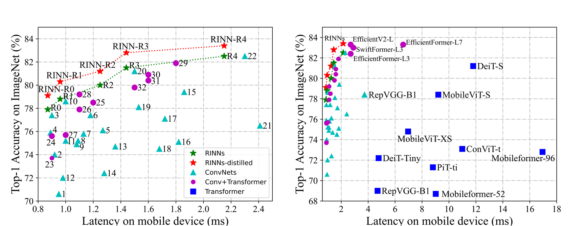

# RINN: Official implementation of the "Lightweight Re-parameterizable Integral Neural Networks for Mobile Applications".
## [[Paper]][paper_link] [[Supplementary]][apendix_link] [[Project site]][project_link]

## Table of contents
- [RINN](#RINN)
- [Requirements](#requirements)
- [Installation](#installation)
- [Usage examples](#usage-examples)
- [Frequently asked questions](#frequently-asked-questions)
- [Further research](#further-research)
- [References](#references)

This library is official implementation of "Lightweight Re-parameterizable Integral Neural Networks for Mobile Applications" paper in Windows system and with CUDA libraries.



## Requirements
- pytorch 2.0+
- torchvision
- numpy
- scipy
- Cython
- catalyst
- pytorchcv

## Installation

```
git clone https://github.com/ljh3832-ccut/RINN.git
pip install RINN/
```
or
```
pip install git+https://github.com/ljh3832-ccut/RINN.git
```

## Usage examples
### Convert your model to RINN model:
```python
import torch
import torch_integral as inn
from torchvision.models import resnet18

model = resnet18(pretrained=True)
wrapper = inn.IntegralWrapper(init_from_discrete=True)

# Specify continuous dimensions which you want to prune
continuous_dims = {
    "layer4.0.conv1.weight": [0],
    "layer4.1.conv1.weight": [0, 1]
}

# Convert to integral model
inn_model = wrapper(model, (1, 3, 224, 224), continuous_dims)
```

Set distribution for random number of integration points:
```python
inn_model.groups[0].reset_distribution(inn.UniformDistribution(8, 16))
inn_model.groups[1].reset_distribution(inn.UniformDistribution(16, 48))
```

Train integral model using vanilla training methods. 
Ones the model is trained resample (prune) it to arbitrary size:
```python
inn_model.groups[0].resize(12)
inn_model.groups[1].resize(16)
```

After resampling of the integral model it can be evaluated as usual discrete model:
```python
discrete_model = inn_model.get_unparametrized_model()
```

### One can use [`torch_integral.graph`](./torch_integral/graph/) to build dependecy graph for structured pruning:
```python
from torch_integral import IntegralTracer

groups = IntegralTracer(model, example_input=(3, 28, 28)).build_groups()
pruner = L1Pruner()

for group in groups:
    pruner(group, 0.5)
```

### Integrating a function using numerical quadratures:
```python
from torch_integral.quadrature import TrapezoidalQuadrature, integrate
import torch

def function(grid):
    return torch.sin(10 * grid[0])

quadrature = TrapezoidalQuadrature(integration_dims=[0])
grid = [torch.linspace(0, 3.1415, 100)]
integrate(quadrature, function, grid)
```

More examples can be found in [`examples`](./examples) directory.

## Frequently asked questions
See [FAQ](FAQ.md) for frequently asked questions.

## Further research
Here is some ideas for community to continue this research:
- Weight function parametrization with [SiReN](https://arxiv.org/pdf/2006.09661.pdf).
- Combine INNs and [neural ODE](https://arxiv.org/pdf/1806.07366.pdf).
- For more flexible weight tensor parametrization let the function have breakpoints.
- Multiple TSP for total variation minimization task.
- Due to lower total variation of INNs it's interesting to check resistance of such models to adversarial attacks.
- Train integral GANs.
- Research different numerical quadratures, for example Monte-Carlo integration or Bayesian quadrature.

## References
If this work was useful for you, please cite it with:
```
@article{Lin_2025_,
    author    = {Jin-Hua, Lin and Lin, Ma and Yong-Quan, Yang and Hong-Hai, Sun and Bo-Wen, Ren and Xiang-Dong, Hao},
    title     = {Lightweight Re-parameterizable Integral Neural Networks for Mobile Applications},
    journal = {arXiv},
    year      = {2025},
}
```
and
```
@misc{RINN,
	author={Jin-Hua Lin, Lin Ma},
	title={RINN},
	year={2025},
	url={https://github.com/ljh3832-ccut/RINN},
}
```

[paper_link]: https://github.com/ljh3832-ccut/RINN
[apendix_link]: https://github.com/ljh3832-ccut/RINN
[project_link]: https://github.com/ljh3832-ccut/RINN
