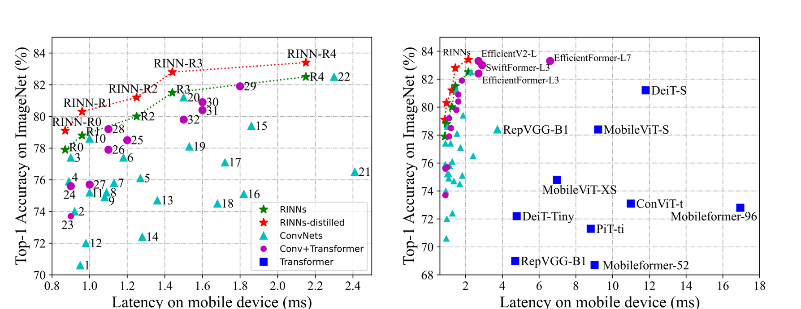

# RINN: Official implementation of the "Lightweight Re-parameterizable Integral Neural Networks for Mobile Applications" TNNLS.
## Table of contents
- [TorchIntegral](#torchintegral)
- [Requirements](#requirements)
- [Installation](#installation)
- [Usage examples](#usage-examples)
- [Frequently asked questions](#frequently-asked-questions)
- [Further research](#further-research)
- [References](#references)

This library is official implementation of "Lightweight Re-parameterizable Integral Neural Networks for Mobile Applications" paper in Pytorch.



## Requirements
- pytorch 2.0+
- torchvision
- numpy
- scipy
- Cython
- catalyst
- pytorchcv

## Installation

```
git clone https://github.com/ljh3832-ccut/RINN.git
pip install RINN/
```
or
```
pip install git+https://github.com/ljh3832-ccut/RINN.git
```

## Usage examples
### Load RINN model:
```python
import torch
import RINN
PARAMS = {
        "s0": {"width_multipliers": (0.75, 1.0, 1.0, 2.0), "num_conv_branches": 3},
        "s1": {"width_multipliers": (1.5, 1.5, 2.0, 2.5), "num_conv_branches": 1},
        "s2": {"width_multipliers": (1.5, 2.0, 2.5, 4.0), "num_conv_branches": 1},
        "s3": {"width_multipliers": (2.0, 2.5, 3.0, 4.0), "num_conv_branches": 1},
        "s4": {"width_multipliers": (3.0, 3.5, 3.5, 4.0), "num_conv_branches": 1, "use_se": True},
    }
    variant_params = PARAMS["s0"]
    net=RINN.rinn(num_classes=1000,  **variant_params)
    checkpoint="model_eval_123.pth"
    if checkpoint is not None:
        with open(checkpoint,"rb") as f:
            state_dict=torch.load(f)
        net.load_state_dict(state_dict)
```
### Convert RINN to integral model:
```python
from torch_integral import standard_continuous_dims

model = net.cuda()
wrapper = IntegralWrapper(
    init_from_discrete=True,
    fuse_bn=True,
    permutation_iters=3000,
    optimize_iters=0,
    start_lr=1e-3,
    verbose=True,
)

# Specify continuous dimensions which you want to prune
continuous_dims = standard_continuous_dims(model)
continuous_dims.update({"linear.weight": [1], "linear.bias": []})

# Convert to integral model
RINN_model = wrapper(model, [1, 3, 224, 224], continuous_dims)
```

Set distribution for random number of integration points:
```python
inn_model.groups[0].reset_distribution(inn.UniformDistribution(8, 16))
inn_model.groups[1].reset_distribution(inn.UniformDistribution(16, 48))
```

Train integral model using vanilla training methods. 
Ones the model is trained resample (prune) it to arbitrary size:
```python
inn_model.groups[0].resize(12)
inn_model.groups[1].resize(16)
```

After resampling of the integral model it can be evaluated as usual discrete model:
```python
discrete_model = inn_model.get_unparametrized_model()
```

### One can use [`torch_integral.graph`](./torch_integral/graph/) to build dependecy graph for structured pruning:
```python
from torch_integral import IntegralTracer

groups = IntegralTracer(model, example_input=(3, 28, 28)).build_groups()
pruner = L1Pruner()

for group in groups:
    pruner(group, 0.5)
```

### Integrating a function using numerical quadratures:
```python
from torch_integral.quadrature import TrapezoidalQuadrature, integrate
import torch

def function(grid):
    return torch.sin(10 * grid[0])

quadrature = TrapezoidalQuadrature(integration_dims=[0])
grid = [torch.linspace(0, 3.1415, 100)]
integrate(quadrature, function, grid)
```

More examples can be found in [`examples`](./examples) directory.

## Frequently asked questions
See [FAQ](FAQ.md) for frequently asked questions.

## TODO
- Add models zoo.
- Fix tracing of reshape and view operations.
- Add integral self attention and batch norm layers.

## Further research
Here is some ideas for community to continue this research:
- Weight function parametrization with [SiReN](https://arxiv.org/pdf/2006.09661.pdf).
- Combine INNs and [neural ODE](https://arxiv.org/pdf/1806.07366.pdf).
- For more flexible weight tensor parametrization let the function have breakpoints.
- Multiple TSP for total variation minimization task.
- Due to lower total variation of INNs it's interesting to check resistance of such models to adversarial attacks.
- Train integral GANs.
- Research different numerical quadratures, for example Monte-Carlo integration or Bayesian quadrature.

## References
If this work was useful for you, please cite it with:
```
@InProceedings{Solodskikh_2023_CVPR,
    author    = {Solodskikh, Kirill and Kurbanov, Azim and Aydarkhanov, Ruslan and Zhelavskaya, Irina and Parfenov, Yury and Song, Dehua and Lefkimmiatis, Stamatios},
    title     = {Integral Neural Networks},
    booktitle = {Proceedings of the IEEE/CVF Conference on Computer Vision and Pattern Recognition (CVPR)},
    month     = {June},
    year      = {2023},
    pages     = {16113-16122}
}
```
and
```
@misc{TorchIntegral,
	author={Kurbanov A., Solodskikh K.},
	title={TorchIntegral},
	year={2023},
	url={https://github.com/TheStageAI/TorchIntegral},
}
```

[paper_link]: https://openaccess.thecvf.com/content/CVPR2023/papers/Solodskikh_Integral_Neural_Networks_CVPR_2023_paper.pdf
[apendix_link]: https://openaccess.thecvf.com/content/CVPR2023/supplemental/Solodskikh_Integral_Neural_Networks_CVPR_2023_supplemental.pdf
[project_link]: https://inn.thestage.ai/
[medium_link]: https://medium.com/@TheStage_ai/unlocking-2x-acceleration-for-dnns-transforming-models-with-integral-neural-networks-in-just-1-3b76cbfc4b31
